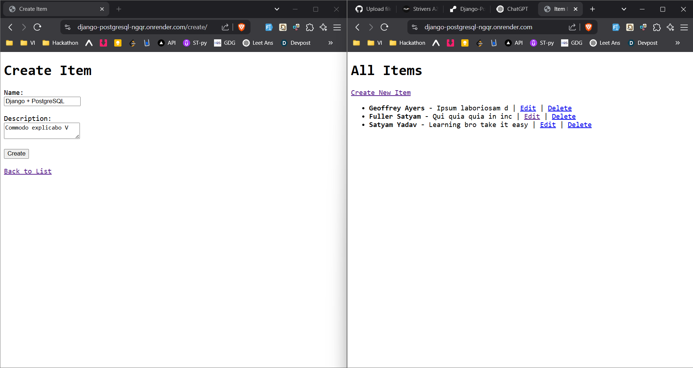

# 🚀 Django + PostgreSQL CRUD App
A beginner-friendly Django project to **connect PostgreSQL locally and online** and perform **full CRUD operations**. This project helps understand PostgreSQL integration with Django in both development and production environments.

> 🌐 # Live Demo : https://django-postgresql-ngqr.onrender.com

> 📁 # Source Code : https://github.com/SimpleCyber/Django-PostgreSQL-
> 
> 📷 # Demo


---

## 📌 Features

- 🔄 Create, Read, Update, Delete operations using Django
- 🗃️ PostgreSQL as a database (local & online)
- 🌐 Hosted on [Render](https://render.com)
- 📦 Proper model & admin integration
- 🧪 Tested with Django ORM
- 🧑‍💻 Minimal & clean UI using Django Templates

---

## 🛠️ Tech Stack

- **Backend**: Django (Python)
- **Database**: PostgreSQL
- **Frontend**: HTML5, CSS3, Django Templates
- **Hosting**: Render
- **Tools**: Git, GitHub, PgAdmin (for local DB)

---

## 🧰 Local Setup

1. **Clone the repository**
   ```bash
   git clone https://github.com/SimpleCyber/Django-PostgreSQL-.git
   cd Django-PostgreSQL-
   ```

2. **Create a virtual environment and activate**
   ```bash
   python -m venv venv
   source venv/bin/activate  # Linux/macOS
   venv\Scripts\activate     # Windows
   ```

3. **Install dependencies**
   ```bash
   pip install -r requirements.txt
   ```

4. **Setup your `.env` file**
   ```
   DEBUG=True
   SECRET_KEY=your_secret_key
   DATABASE_NAME=your_db_name
   DATABASE_USER=your_db_user
   DATABASE_PASSWORD=your_db_password
   DATABASE_HOST=localhost
   DATABASE_PORT=5432
   ```

5. **Run migrations**
   ```bash
   python manage.py makemigrations
   python manage.py migrate
   ```

6. **Start the server**
   ```bash
   python manage.py runserver
   ```

---

## 📦 PostgreSQL Setup

### 🔹 Local

- Use `pgAdmin` or `psql` to create a database
- Update your `.env` with correct credentials
- Use Django’s ORM to auto-create tables

### 🔹 Online (Render)

- Add a PostgreSQL service on Render
- Connect using the database URL and map it in `settings.py`
- Make sure to set `ALLOWED_HOSTS`, `DEBUG=False` and use `dj-database-url` for parsing

---

## 🧪 CRUD Operations

- 🟢 **Create** – Add new items through a form
- 🟡 **Read** – Display all entries on the homepage
- 🔵 **Update** – Edit existing entries
- 🔴 **Delete** – Remove entries with confirmation

---

## 🤝 Contributing

Contributions and suggestions are welcome! Open an issue or fork the repo to suggest improvements.

---

## 📄 License

This project is licensed under the [MIT License](LICENSE).

---

## ✨ Developed By

**Satyam Yadav**  
👨‍💻 [GitHub](https://github.com/SimpleCyber) | 💼 [LinkedIn](https://www.linkedin.com/in/satyam-yada/)
